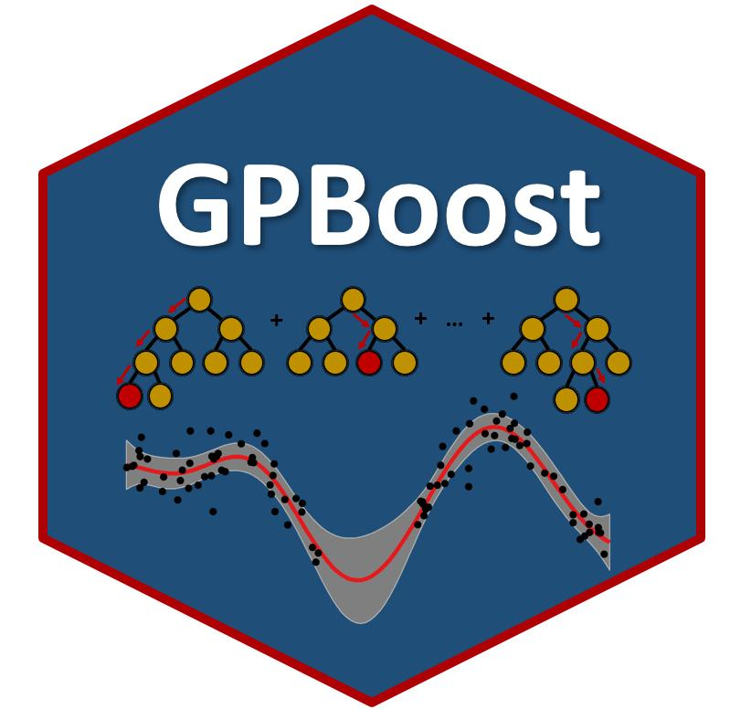

.. GPBoost documentation master file

|

Documentation of GPBoost
========================

**LightGBM** is a gradient boosting framework that uses tree based learning algorithms. It is designed to be distributed and efficient with the following advantages:

- Faster training speed and higher efficiency.
- Lower memory usage.
- Better accuracy.
- Support of parallel and GPU learning.
- Capable of handling large-scale data.

.. toctree::
   :maxdepth: 1
   :caption: Contents:

   Main Parameters <Main_parameters>
   All tree-boosting (i.e., not random effects) related parameters <Parameters>
   Installation Guide <Installation_guide>
   C API <C-API>
   Python API <Python-API>
   R API <https://gpboost.readthedocs.io/en/latest/R/reference/>

.. toctree::
   :hidden:

   README

Indices and Tables
==================

* :ref:`genindex`
